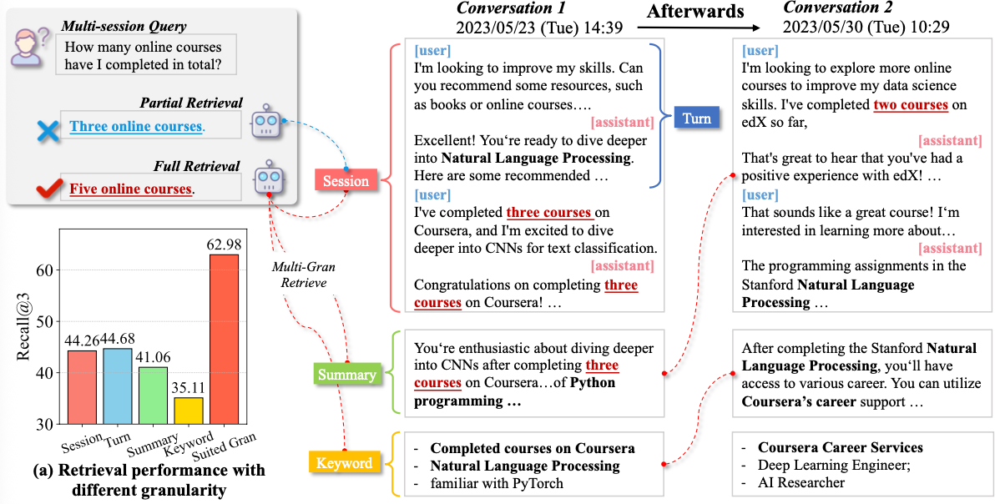

<div align="center">
  <picture>
    <source srcset="./assets/intro.png" media="(prefers-color-scheme: dark)">
    
  </picture>
</div>

# MemGAS

Our work has been accepted to **ICLR 2026**: *From Single to Multi-Granularity: Toward Long-Term Memory Association and Selection of Conversational Agents*.

### Environment
    conda create -n memgas python=3.9
    conda activate memgas
    pip install torch==2.3.1 torchvision==0.18.1 torchaudio==2.3.1 --index-url https://download.pytorch.org/whl/cu121
    pip install -r requirements.txt

## Quickly Start
Basic memory APIs are wrapped in the new `quickstart/` directory, without changing the original reproduction code.

### 1) Initialize
```python
from quickstart import MemGASMemory, MemoryConfig

mem = MemGASMemory(
    MemoryConfig(
        storage_dir="./memgas_store",
        embedder="contriever",          # contriever/mpnet/minilm/qaminilm
        llm_provider="openai",          # openai or vllm
        llm_model="gpt-4o-mini",
        llm_api_key="YOUR_API_KEY",     # or use the OPENAI_API_KEY environment variable
        llm_base_url="YOUR_BASE_URL",   # optional, for OpenAI-compatible services
        default_mode="memgas",          # memgas/lite/session_level/...
    )
)
```

### 1.1) Serve a local model with vLLM
Start a local OpenAI-compatible endpoint:
```bash
vllm serve Qwen/Qwen2.5-7B-Instruct --port 8000
```

Then initialize MemGAS with `llm_provider="vllm"`:
```python
from quickstart import MemGASMemory, MemoryConfig

mem = MemGASMemory(
    MemoryConfig(
        storage_dir="./memgas_store",
        embedder="contriever",
        llm_provider="vllm",
        llm_model="Qwen/Qwen2.5-7B-Instruct",
        llm_base_url="http://localhost:8000/v1",
        llm_api_key="EMPTY",        
        default_mode="memgas",
    )
)
```


### 2) Add Sessions
`session` should be `list[str]`. Each element can be plain text or a dialogue turn (for example, `"[User]: ... [AI]: ..."`).
Internally, the system calls an LLM to generate `summary` and `keywords`, then builds multi-granularity vector representations.

```python
session = [
    "[User]: I moved to Seattle last month. [AI]: How is the weather there?",
    "I started a new job at a robotics startup and commute by bike.",
]

memory_id = mem.add(
    session=session,
    conversation_id="user_001", # optional; if omitted, retrieval runs globally
    metadata={"source": "demo"},
)

# add another session as a new memory entry
memory_id_2 = mem.add(
    conversation_id="user_001",
    session=[
        "[User]: I moved to Seattle in January. [AI]: Nice change!",
        "I now work on robot navigation systems.",
    ],
)
```

### 3) Retrieve
```python
hits = mem.retrieve(
    query="Where did I move recently and what is my new job?",
    topk=3,
    conversation_id="user_001",  # optional; if omitted, retrieval runs globally
    mode="memgas",
)

for hit in hits:
    print(hit["memory_id"], hit["score"])
    print("summary:", hit["summary"])
    print("keywords:", hit["keywords"])
```

### 4) Persistence
```python
mem.save()  # manual save; add also auto-saves by default
```


## Reproduce 

### Data Process
Download the original data:

    - Download the LongMemEval-s LongMemEval-m datasets from https://github.com/xiaowu0162/LongMemEval
    - Download the LoCoMo-10 dataset from https://github.com/snap-research/locomo/blob/main/data/locomo10.json
    - Download the Long-MT-Bench+ dataset from https://huggingface.co/datasets/panzs19/Long-MT-Bench-Plus

Put the original data in `data/origin_data/`, and  run:

```python
cd data/
python dataprocess.py
```
The processed data will be available in `data/process_data/`

### Generating the multigranularity information
**Enter your API key and URL** in `src/construct/multigran_generation.py` and `src/generation/async_llm.py`, and run:

```python
cd src/construct/
multigran_generation.py
```
The generated results will be stored in  `../../multi_granularity_logs/`

### Memory Retrieval
Run the following commands to reproduce single granularity and multi-granularity results:

```python
cd src/retrieval/


# single granularity
python3 run_retrieval.py --dataset locomo10 --retriever contriever --method session_level
python3 run_retrieval.py --dataset locomo10 --retriever contriever --method turn_level
python3 run_retrieval.py --dataset locomo10 --retriever contriever --method summary_level
python3 run_retrieval.py --dataset locomo10 --retriever contriever --method key_level

# multi granularity
python3 run_retrieval.py --dataset locomo10 --retriever contriever --method hybrid_level

python3 run_retrieval.py \
  --dataset locomo10 \
  --retriever contriever \
  --method memgas \
  --num_seednodes 15 \
  --mem_threshold 30 \
  --damping 0.1 \
  --temp 0.2

```
Change the --dataset parameter to  `locomo10` `longmemeval_s` `longmemeval_m` `LongMTBench+` for experiments on other datasets.


### Generation
To conduct QA experiements, run:
```python
cd src/generation/

python generation.py --dataset locomo10 --retriever contriever --model_name_or_path gpt-4o-mini --topk 3 --method memgas

```

The generated results will be saved in `generation_logs`, and the metrics can be found in `generation_logs/metrics/`

#### Evaluation
Evaluating with GPT4o:

The code only requires --eval_file for geneated path, --model_name_or_path for evaluation:
```python
cd src/evaluation/
python llm_judge_single.py --model_name_or_path gpt-4o --eval_file  locomo10-contriever-memgas_filter-gpt-4o-mini-topk_3.jsonl

```

Evaluating different query types:
```python
cd src/evaluation/
python eval_query_type.py --eval_file ../../generation_logs/locomo10-contriever-memgas_filter-gpt-4o-mini-topk_3.jsonl
```

## Citation
If you find this work useful, please cite:

```bibtex
@inproceedings{
xu2026from,
title={From Single to Multi-Granularity: Toward Long-Term Memory Association and Selection of Conversational Agents},
author={Derong Xu and Yi Wen and Pengyue Jia and Yingyi Zhang and Wenlin Zhang and Yichao Wang and Huifeng Guo and Ruiming Tang and Xiangyu Zhao and Enhong Chen and Tong Xu},
booktitle={The Fourteenth International Conference on Learning Representations},
year={2026},
url={https://openreview.net/forum?id=i2yIvZARnG}
}
```
